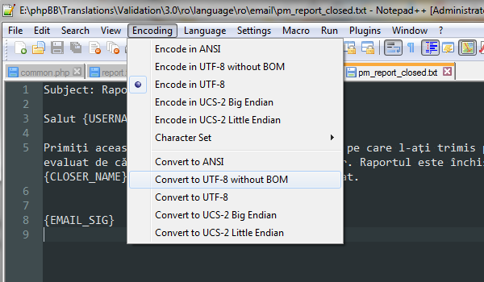

# File must be encoded using UTF8 without BOM

The failure should be quite easy to fix and it's also possible on windows.
Most editors have a one-click option for that.
E.g. if you use [Notepad++](http://www.notepad-plus-plus.org/) to translate the files:

`Encoding` => `Convert to UTF8 without BOM`:

